# Douglas County Fire District No. 4 (Orondo Fire Department)
## Architectural Blueprint & Systems Engineering Map

### 1. Architectural System Overview

The Douglas County Fire District 4 (DCFD4) web platform is architected as an edge-native web application deployed globally across Cloudflare Workers at:
**https://orondo-fire-dept.isaac-king5050.workers.dev**

It combines Cloudflare Workers Static Assets with an edge form router, Web Audio procedural synthesis, client-side HTML5 canvas simulations, a tactical Wildland Fire Tower Defense game engine, strict AI domain boundaries with interactive markdown site navigation, a dedicated wildfire maps and public resources portal, and an authentic 40-year photo archive presented as an interactive movable pure-image flex gallery.

```mermaid
sequenceDiagram
    autonumber
    actor Resident as Resident / Mobile Citizen
    participant Worker as Cloudflare Worker Edge (src/worker.ts)
    participant Client as React SPA Client (Vite + Tailwind)
    participant EdgeAI as Cloudflare AI Edge Proxy
    participant Email as Transactional Email / Webhook Router

    Resident->>Worker: GET / (Initial Load)
    Worker-->>Client: Stream Pre-rendered HTML5 + Static Assets (< 250ms)
    Client->>Client: Check Burn Ban Calendar (June 1 - Sept 30)
    
    rect rgb(20, 30, 45)
    Note over Resident,Client: Form Submission Flow
    Resident->>Client: Submit Burn Notice / Volunteer Interest
    Client->>Worker: POST /api/submit-form (JSON Payload)
    Worker->>Worker: Validate Fields + Honeypot Check
    Worker->>Worker: Generate Official Ref (DCFD4-BURN-2026-XXXXXX)
    Worker->>Email: Dispatch Alert to info@dcfd4.com / Webhook
    Worker-->>Client: Return Confirmation Receipt + Status 200
    Client-->>Resident: Display Verified Receipt Card
    end

    rect rgb(30, 20, 35)
    Note over Resident,EdgeAI: AI Community Safety Assistant & Site Guide
    Resident->>Client: Ask Burning / Wildfire Map / Volunteer Question
    Client->>EdgeAI: POST /nvidia/v1/chat/completions (Full Sitemap Prompt)
    alt Within District Scope
        EdgeAI-->>Client: Official Safety Information + Clickable [Page](/tab) Links
    else Off-Topic Query (Coding, Recipes, Trivia)
        EdgeAI-->>Client: Polite District Scope Refusal + [Home](/) Link
    end
    Client-->>Resident: Render Interactive Link Buttons in Chat Modal
    Resident->>Client: Click [Wildfire Maps](/resources)
    Client->>Client: Instant Tab Navigation to Selected Resource
    end
```

---

### 2. Foundational Engineering Pillars

#### 2.1 Full HTML5 Browser History Routing & Dynamic SEO Engine (`src/App.tsx`, `src/worker.ts`)
* **Clean Real-World URLs:**
  - Migrated from a single-URL SPA to authentic HTML5 History API routing. Navigating between sections calls `window.history.pushState(null, '', path)` so every page has its own real URL (`/burn-permits`, `/volunteer`, `/calendar`, `/resources`, `/stations`, `/gallery`, `/fire-game`, `/about`, `/contact`).
  - Listens to `window.addEventListener('popstate')` for native browser Back and Forward navigation buttons.
  - Dynamically updates `document.title` on each route change (e.g. `Outdoor Burn Rules & Permits | DCFD4 Orondo`), allowing search engines and social crawlers to index distinct pages.
* **Cloudflare Workers Assets SPA Edge Fallback:**
  - Configured `binding: "ASSETS"` and `not_found_handling: "single-page-application"` in `wrangler.jsonc`.
  - In `src/worker.ts`, edge requests to extensionless deep paths are cleanly served `index.html` with status 200, enabling direct bookmarking, external linking, and search bot indexing.

#### 2.2 Action-Oriented Community Roadmap Architecture (`src/components/HomeOverview.tsx`)
* **Structured 6-Step Resident Service Matrix:**
  - Architected as a modular, uncluttered action roadmap addressing the 6 primary community interaction vectors:
    1. `Submit Burn Request`: Real-time seasonal ban verification and online notification dispatch.
    2. `Volunteer With DCFD4`: Turnout gear, certified academy training, and station living quarters info.
    3. `Donate to Association`: Direct online PayPal checkout integration (`https://www.paypal.com/donate?token=...`) and 501(c)(3) tax-exempt check mailing instructions for frontline apparatus and PPE funding.
    4. `District Calendar`: Governance meetings (3rd Wednesday of every month at 5:30 PM) and Tuesday drill evolutions.
    5. `Wildfire & Smoke Maps`: Multi-agency radar (Watch Duty, WA DNR, EPA AirNow).
    6. `Contact Headquarters`: Headquarters address, telephone lines, and dispatch routing.
* **Minimalist, High-Efficiency UI:**
  - Removed decorative pills, badges, and repetitive micro-cards. Icons are functional anchors for eye-scanning.
  - Every card includes a bold title, concise description, contained contextual facts, and full-width 44px+ tap target buttons.
* **PayPal 501(c)(3) Online Donation Pipeline:**
  - Integrated official checkout token (`_0oLbUMVORj9lEdQGnlH3L_VMTZTAk-OsQN6wcJAb_9i-HsHqkwRQUIl-kZfZ3ggL2E6ubc1Lbs8cvTG`) verified via BrowserOS Neo for "Douglas County Fire District 4".
  - Implemented across Home Overview (Card #3), Contact & Donate page (`/contact`), Global Footer, and AI assistant knowledge base.

#### 2.3 Station 244 (23420 US-97) Authentic Photo & Strategic Fleet Assets (`src/components/StationsPage.tsx`)
* **Authentic Station 244 Documentation:**
  - Station 244 (23420 US Highway 97, Orondo, WA): Updated with authentic user-provided photograph capturing the 3 red apparatus bays positioned against the hillside on US-97.
  - Full district readiness documented across Stations 241, 242, 243, and 244 with direct Google Maps navigation links.

#### 2.4 Active Burning Flame Circle & Canvas Water Spray Easter Egg (`src/components/Hero.tsx`)
* **Continuous Combustion Simulation:**
  - The flame ring around the Rattlesnake emblem features dual rotating dashed SVG rings, glowing radial embers, and fiery amber box shadows active by default.
* **Fire Attack Game Canvas Spray Physics & Permanent Extinguish:**
  - Clicking the logo emblem activates an interactive canvas particle spray matching the exact physics from the Fire Attack game:
    - Pressurized stream of glowing cyan water droplets (`#38bdf8`) shooting from a brass nozzle with gravity arc.
    - Droplets strike the burning ring, spawning billowing white steam clouds that drift upward and fade.
    - Procedural dual-tone Web Audio synthesis simulating pressurized water rush and boiling steam sizzle.
    - Douses and permanently extinguishes the flame ring into cool grayscale.
    - **Permanent Extinguish Law:** Once put out, the flame never relights or rekindles automatically.
  - Pure Easter egg with zero instruction text or prompt clutter.
* **Single-Source Content Hierarchy (Zero Redundancy):**
  - Stated all core facts in dedicated, authoritative locations:
    - `Station 241 Headquarters • Orondo, WA` resides solely in the top dispatch row.
    - `Douglas County Fire District No. 4` is the sole subtitle below the main motto.
    - Operational scope (`24/7 all-hazard fire suppression, wildland protection, and emergency medical services across the East Columbia River corridor and orchards`) is contained in the narrative.
    - Dedicated badge `100% Volunteer Fire & EMS`, physical metrics (`4 Stations • 100+ Sq Miles • Est. 1946`), and service areas (`Protecting Orondo • Brays • Lone Pine • Beebe Bridge`) are unified under the official emblem.
    - Removed redundant text across the alert banner, subheads, and narrative.

#### 2.5 Wildfire Maps, Air Quality, Emergency Alerts & Legal Regulations (`src/components/ResourcesPage.tsx`, `src/components/OpenBurningPage.tsx`)
* **Verified Multi-Agency Incident Radar & Codified Regulations:**
  - 100% verified live via BrowserOS Neo browser automation, eliminating legacy 404 dead links and misdirected public records pages:
    - *Satellite Hotspots:* NASA FIRMS 3-hour MODIS/VIIRS thermal anomaly scans.
    - *Active Incidents:* Watch Duty (radio traffic and evacuation boundaries), WA DNR dashboard, and federal InciWeb.
    - *Air Quality & Smoke Plumes:* EPA AirNow real-time PM2.5 sensors and WA Smoke Blog forecasts.
    - *County Emergency Notifications:* Douglas County Emergency Management (`https://www.douglascountywa.gov/231/Emergency-Management`), Everbridge evacuation alerts signup (`https://www.douglascountywa.gov/693/Everbridge-Emergency-Alert-System`), and live Emergency Incidents Map (`https://www.douglascountywa.gov/697/Emergency-Incidents-Map`).
    - *NWS Fire Weather Forecast:* National Weather Service Western Region WFO Spokane Fire Weather Briefing (`https://www.weather.gov/wrh/fire?wfo=otx&layer=fwx`).
    - *Hydrologic Monitoring:* USGS Washington State Water Conditions & Streamflow (`https://waterdata.usgs.gov/state/Washington/`).
    - *Codified County & State Burning Regulations:* Douglas County Code Chapter 8.12 Open Burning (`https://www.codepublishing.com/WA/DouglasCounty/html/DouglasCounty08/DouglasCounty0812.html`), WAC 173-425 Outdoor Burning rule (`https://app.leg.wa.gov/wac/default.aspx?cite=173-425`), WA DNR Burn Restrictions under WAC 332-24 (`https://dnr.wa.gov/wildfire-resources/outdoor-burning/burn-restrictions`), and WA Department of Ecology Burn Permits Portal (`https://ecology.wa.gov/regulations-permits/permits-certifications/air-quality-permits/burn-permits`).
  - Equipped with real-time text search and 5 category filter pills: `All Resources (18)`, `Wildfire Maps & Apps`, `Smoke & Weather`, `Local Douglas County`, and `Codes & Regulations`.

#### 2.6 AI Assistant Interactive Markdown Navigator (`src/services/aiGateway.ts`, `src/components/AiAssistantModal.tsx`)
* **Full Sitemap Context:**
  - AI system prompt incorporates complete route mappings for all district pages and external state agencies.
  - Answers include structured markdown links formatted as `[Page Title](/tab-name)`.
* **In-Modal Navigation Parser:**
  - Parses markdown syntax in client memory:
    - Internal `/tab` links render as styled interactive buttons that execute `onNavigate(tab)` and dismiss the modal.
    - External URLs render with `ExternalLink` icons opening in secure new tabs (`rel="noopener noreferrer"`).
  - Client-side fallback knowledge base matches all core inquiries with markdown navigation links even during edge network fluctuations.

#### 2.7 Bloons TD 5 / BTD 6 Wildland Firefighting Tower Defense Engine (`src/components/FireGamePage.tsx`)
* **Bloons TD 5 Track Geometry & Interpolated Movement Physics:**
  - **Serpentine Waypoint Track:** Continuous 2,090px path across 11 precision waypoints (`TRACK_WAYPOINTS`) traversing orchard lands, crossing the Columbia River over a wooden plank bridge, and terminating at Station 241 Headquarters.
  - **Precomputed Segment Geometries:** Pre-calculated cumulative segment distances (`CUMULATIVE_LENGTHS`) allow instant `O(log n)` / constant-time coordinate interpolation along curves via `getCoordinateAtDistance(dist)`.
* **Fire Balloon Tiers (Popping & Splitting Hierarchy):**
  - **8 Distinct Fire Balloon Classes:**
    - T1: Red Grass Spark (1 HP, 1.35 speed)
    - T2: Blue Campfire Blaze (2 HP, 1.7 speed, splits into 1 Red Spark)
    - T3: Green Brush Fire (3 HP, 2.1 speed, splits into 1 Blue Campfire)
    - T4: Yellow Crown Fire (4 HP, 2.8 speed, splits into 1 Green Brush Fire)
    - T5: Pink Timber Flame (5 HP, 3.4 speed, splits into 1 Yellow Crown Fire)
    - T6: Charcoal Armored Smolder (8 HP, 1.1 speed, ember-shielded; splits into 2 Pink Timber Flames)
    - T7: Canyon Firestorm (12 HP, 2.0 speed; splits into 2 Armored Smolders)
    - T8: Badger Mountain Boss Inferno (80 HP, 0.9 speed; splits into 4 Canyon Firestorms upon containment)
* **Institutional Tower Apparatus & Dual 3-Tier Upgrade Paths:**
  - 6 Apparatus Types: Hose Volunteer ($175), Deck Gun Monitor ($350, AOE splash), Perimeter Sprinkler ($240, 360-degree mist), Type 6 Brush Engine ($480, 4x4 foam vehicle), Columbia River Fireboat ($420, water-only draft vessel), and Dozer Line Scrape ($160, 12-hit contact trap).
  - Dual 3-tier upgrade paths per unit (e.g. Hose Volunteer: Water Pressure vs Reach & Class A Foam).
  - Target Priority Selector (First, Last, Strongest, Closest).
  - 70% capital liquidation refund upon selling.
* **Decoupled 60 FPS Engine with Background Tab Visibility Fallback:**
  - Animation and collision state maintained in high-performance mutable refs (`gameRef`), syncing to React state (`cash`, `score`, `lives`, `round`) at most once per frame to prevent React render thrashing.
  - Native Web Audio oscillators throttled to 40ms intervals to eliminate audio thread crackling.
  - Background Tab Visibility Handler: Detects `document.hidden` and activates a 33ms interval fallback loop, ensuring uninterrupted simulation progress across tab switching and headless browser automation. Exposes `window.__dcfd4_game.tick(frames)` for deterministic automated testing.

#### 2.8 Interactive Movable Pure-Image Flex Gallery Architecture (`src/components/GalleryPage.tsx`)
* **Strictly Zero Words On Cards:**
  - Pure photography showcase with zero text or badges.
  - HTML5 drag-and-drop reordering, 3D cursor parallax tilt, and dual display modes (Fluid Flex Grid and Kinetic Movable Ribbon Stream).

#### 2.9 Real-Time Seasonal Burn Ban Transition Engine (`src/services/burnBanService.ts`)
* **Mathematical Schedule Model:**
  - `isBurnBanDate(date)`: Evaluates Month index in JS (June = 5 through September = 8). Active from June 1 at 00:00:00 to September 30 at 23:59:59.
  - `calculateCountdownDays(date, isActive)`: Plain English millisecond delta calculation against October 1 (when active) and June 1 (when lifted).
* **Zero-Reload Heartbeat:**
  - Both `App.tsx` and `LiveAlertBanner.tsx` run an active 30-second interval ticker and listen to browser `visibilitychange` events.
  - When midnight strikes on October 1st, state transitions automatically from red warning to emerald green open burning across the alert banner, hero CTA, roadmap Card 1, regulations page, and footer without requiring a user reload.

#### 2.10 Calendar Visible Slice & Historical Month Filtering (`src/components/CalendarPage.tsx`)
* **Dynamic Active Month Slicing:**
  - Evaluates client-side system date: `today.getFullYear()` and `today.getMonth()`.
  - When viewing the current year (2026), `visibleMonthIndices` defaults to `[currentActualMonth ... 11]` (e.g. September through December), suppressing months 0 through 7 (January through August).
  - Toggling `showPastMonths` dynamically expands the visible indices array to all 12 months (`0 ... 11`).
  - Active month detection renders an amber `CURRENT` indicator badge next to the current month name.
  - Event filtering automatically excludes events from prior months when past months are hidden, keeping both the 12-month grid and the chronological agenda feed focused on actionable upcoming dates.

#### 2.11 Home Overview Authentic Community Photo Banner Architecture (`src/components/HomeOverview.tsx`)
* **Responsive Photo Integration:**
  - High-resolution local static asset: `/assets/gallery/structure_attack_2014.jpg` (`public/assets/gallery/structure_attack_2014.jpg`).
  - Rendered at the bottom of the "How Can We Help You Today?" section, directly after the 6 action-oriented service cards.
  - Container utilizes `relative rounded-2xl sm:rounded-3xl overflow-hidden border border-slate-800 shadow-2xl aspect-[16/7] sm:aspect-[24/8] max-h-[360px]`.
  - Responsive image element configured with `w-full h-full object-cover object-center` and native browser `loading="lazy"`.
  - Seamless dark slate edge gradient overlay (`bg-gradient-to-t from-slate-950/70 via-transparent to-black/20 pointer-events-none`) for clean integration without distracting text overlays.

