# Douglas County Fire District No. 4 (Orondo Fire Department)
## Full File Dependency Map

### 1. Architectural Dependency Graph

```mermaid
graph TD
    Worker[src/worker.ts - Cloudflare Worker Edge Entry] -->|Serves Static Assets| HTML[index.html & main.tsx]
    Worker -->|POST /api/submit-form| EdgeRouter[Edge Form Verification & Email Dispatch]
    
    HTML --> ThemeCtx[src/context/ThemeContext.tsx - Multi-Theme Provider]
    ThemeCtx --> App[src/App.tsx]
    
    App --> Nav[src/components/Navbar.tsx - Responsive Navigation & Theme Switcher]
    Nav --> ThemeSwitch[src/components/ThemeSwitcher.tsx - 3-Theme Selector]
    App --> Alert[src/components/LiveAlertBanner.tsx]
    App --> Hero[src/components/Hero.tsx - Static Department Crest & Dispatch Info]
    App --> Home[src/components/HomeOverview.tsx - 6-Action Roadmap Grid]
    App --> Cal[src/components/CalendarPage.tsx - Community Photo]
    App --> Gal[src/components/GalleryPage.tsx - Movable Pure-Image Flex Gallery]
    App --> Game[src/components/FireGamePage.tsx - Wildland Tower Defense Simulator]
    App --> Res[src/components/ResourcesPage.tsx - Wildfire Maps & Apps]
    App --> Burn[src/components/OpenBurningPage.tsx - Clean Boundary Map]
    App --> Vol[src/components/VolunteerPage.tsx - 3-Card Action Grid]
    App --> Station[src/components/StationsPage.tsx - 4 Authentic Station Photos]
    App --> About[src/components/AboutPage.tsx - Heritage Archive & Leadership Banner]
    App --> Contact[src/components/ContactPage.tsx - Donate 501c3 & Contact Station 241]
    App --> Foot[src/components/Footer.tsx]
    App --> AIModal[src/components/AiAssistantModal.tsx - Interactive Link Navigator]

    Gal --> GalData[src/data/galleryData.ts - 19 Authentic Records]
    Burn --> FormSvc[src/services/formService.ts]
    Vol --> FormSvc
    Contact --> FormSvc
    FormSvc -->|Fetch /api/submit-form| EdgeRouter

    Cal --> CalData[src/data/calendarEvents.ts]
    Station --> StnData[src/data/stationsData.ts]
    About --> LeadData[src/data/leadershipData.ts]
    AIModal --> AIGateway[src/services/aiGateway.ts - Full Sitemap Context & Clickable Links]

    CalData --> Types[src/types/index.ts]
    StnData --> Types
    LeadData --> Types
    Burn --> Types
    Vol --> Types
    AIGateway --> CloudflareEdge[Cloudflare AI Edge Gateway / Direct NVIDIA NIM]
```

---

### 2. File Manifest & Definitions

| File Path | Core Role & Responsibilities |
| :--- | :--- |
| `src/App.tsx` | Root application orchestrating HTML5 History API URL routing (`/burn-permits`, `/volunteer`, etc.), dynamic SEO document titles, mobile drawer state, and global modals. |
| `src/worker.ts` | Cloudflare Worker edge handler. Serves static SPA assets from `./dist` with SPA fallback for direct deep route URLs, handles `POST /api/submit-form`, traps spambots via honeypot, generates receipt IDs, and dispatches email/webhook alerts. |
| `src/services/formService.ts` | Client-side form helper transmitting burn notices, volunteer applications, and contact inquiries to `/api/submit-form` with offline fallback receipt generation. |
| `src/data/galleryData.ts` | Complete metadata catalog for all 19 authentic historical and operational photographs scraped from `dcfd4.com`. |
| `src/components/ResourcesPage.tsx` | Wildfire Maps, Public Resources & Legal Regulations directory connecting residents to 18 verified live sources: Watch Duty, WA DNR dashboard, InciWeb, NASA FIRMS, AirNow smoke map, RiverCom 911 dispatch, Douglas County Emergency Management, Everbridge alert signups, Douglas County Code Chapter 8.12, WAC 173-425, and WA Ecology burn portals. |
| `src/components/GalleryPage.tsx` | Interactive movable pure-image flex gallery with zero words/badges on cards, HTML5 drag-and-drop reordering, 3D mouse perspective tilt, kinetic drag-to-slide ribbon stream mode, and zero-word theater lightbox. |
| `src/components/FireGamePage.tsx` | Bloons TD 5 / BTD 6 style Wildland Firefighting Tower Defense game engine featuring a 2,090px serpentine cobblestone track across orchards and the Columbia River to Station 241, 8 fire balloon tiers with popping and splitting mechanics, placement vs wave stages, right-hand sidebar with apparatus store and tower upgrade depot (dual 3-tier upgrade paths, targeting priority AI, 70% sell refund), air tanker Phos-Chek retardant strikes, RiverCom 2X pump overdrive, frame-batching state engine, and background tab visibility fallback timer. |
| `src/context/ThemeContext.tsx` | Multi-theme context provider supporting `civic-light` (default), `warm-light`, and `midnight-dark` with `localStorage` persistence and CSS variable sync. |
| `src/components/ThemeSwitcher.tsx` | Accessible dropdown theme switcher in the top navbar enabling instant 1-click theme switching across all 3 variations. |
| `src/components/Hero.tsx` | High-impact visual hero section featuring visible Station 241 background, static authoritative DCFD4 department crest emblem, calm dispatch contact, and zero-duplication content hierarchy. |
| `src/components/HomeOverview.tsx` | Action-oriented 6-step Resident Action Roadmap (Submit Burn Request, Volunteer, Donate via PayPal & Mail, Calendar, Resources, Contact) with subtle secondary icons, clear titles, zero pill clutter, and clean secondary facility links. |
| `src/services/aiGateway.ts` | Client for Cloudflare AI Edge Gateway with full sitemap context and prompt rules instructing the assistant to return clickable markdown navigation links and verified PayPal donation checkout links. |
| `src/components/Navbar.tsx` | Clean desktop navbar matching the 6-step roadmap with an "Explore & Archive ▾" dropdown for secondary pages, integrated ThemeSwitcher, clean brand emblem, and mobile drawer. |
| `src/components/LiveAlertBanner.tsx` | Dynamic banner indicating annual burn ban status with clean civic styling. |
| `src/components/CalendarPage.tsx` | Interactive master calendar with left-sidebar category key, dynamic visible month slice (hiding past months Jan–Aug by default for current year, showing current month Sept–Dec with amber `CURRENT` badge), toggle button to view all 12 months, Google Calendar URL generator, and `.ics` iCal export. |
| `src/components/OpenBurningPage.tsx` | Clean air guidelines, WA Dept of Ecology contact details, clean official jurisdictional boundary map, and edge-connected burn notification form. |
| `src/components/VolunteerPage.tsx` | Recruitment portal with clean service track cards (zero redundant "Role Overview" pills), authentic 3-card weekly evolutions photo grid (zero text descriptions), and edge-connected volunteer application. |
| `src/components/StationsPage.tsx` | Authoritative specifications for Station 241, 242, 243, and 244 with authentic photos for all 4 stations and Google Maps navigation links (zero image descriptions). |
| `src/components/AboutPage.tsx` | Heritage of DCFD4, mission statement, leadership bios, 1984–1985 historic photo spotlight, and leadership apparatus photo banner (zero image descriptions). |
| `src/components/ContactPage.tsx` | Unified Donate & Contact portal featuring Orondo Firefighters Volunteer Association 501(c)(3) direct online PayPal donation checkout, RiverCom dispatch numbers, PO Box 258 mailing info, Station 241 photo, and edge-connected contact form. |
| `src/services/burnBanService.ts` | Centralized seasonal burn ban logic service calculating exact Douglas County Code Chapter 8.12 date windows, active countdown days, and automated real-time state changes at midnight without requiring manual browser refresh. |
| `src/components/AiAssistantModal.tsx` | Conversational assistant and site navigator parsing internal `[Title](/tab)` buttons and external links to guide users across the entire site. |
| `src/__tests__/dcfd4.test.ts` | 26 automated Vitest tests verifying track interpolation geometry, fire tier splitting, river/land placement validation, sell refunds, targeting priority AI, calendar calculations, past month slicing and filtering, stations, leadership, gallery integrity, AI guardrails with navigation link verification, verified live external URLs, burn ban automated seasonal transitions, and form submission logic. |
